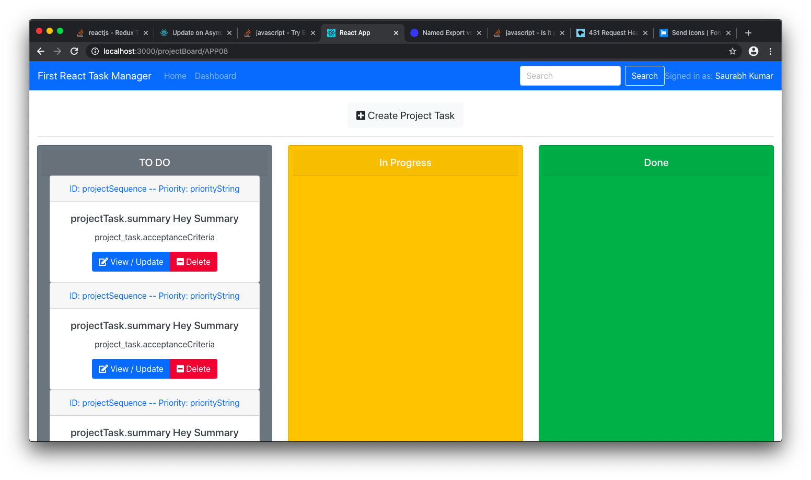

[See the App live](https://codesandbox.io/s/nervous-sunset-ggw3b)

- $ npm i --save @fortawesome/fontawesome-svg-core  @fortawesome/free-solid-svg-icons @fortawesome/react-fontawesome
- https://react-lite-with-bootstrap.herokuapp.com/components.html#buttons
- https://www.npmjs.com/package/@fortawesome/react-fontawesome#usage
- https://react-bootstrap.github.io/components/buttons/
- https://ej2.syncfusion.com/react/documentation/button/how-to/add-link-to-a-button/#:~:text=React-,Add%20link%20to%20a%20Button%20in%20React%20Button%20component,open()%20method.
- https://medium.com/jsessentials/how-to-create-a-reusable-form-with-react-bootstrap-ccc8bd9ba0e3
- https://mdbootstrap.com/docs/react/utilities/flexbox/#docsTabsOverview
- https://jaredpalmer.com/formik/docs/overview
- 

class based components
LifecycleHooks

function based components
stateless

- https://getbootstrap.com/docs/4.0/utilities/spacing/
- https://medium.com/better-programming/using-moment-js-in-react-native-d1b6ebe226d4

This project was bootstrapped with [Create React App](https://github.com/facebook/create-react-app).

## best way to see bootstrap react 
- https://bit.dev/react-bootstrap/react-bootstrap/navbar?example=5c87dc6dd45dc000147367d3

## proxy

- https://create-react-app.dev/docs/proxying-api-requests-in-development/#configuring-the-proxy-manually
-- npm install http-proxy-middleware --save

## form select
- https://react-select.com/home
